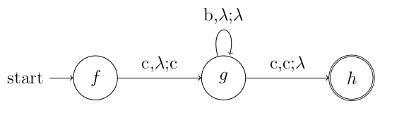
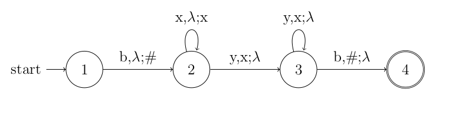

# converter-automaton

Project to convert from Pushdown Automaton (PA) to Context Free Gramar (CFG)

### Install
```
git clone https://github.com/ablarry/converter-automaton 
```

### Qucickstart
```
go run cmd/main.go pusdown-automata-file.pd string-to-evaluate
```

#### Example 

#### Pushdown- automata represented by file example4.ptd




#### Input
```
go run cmd/main.go ./test/model/example4.pd cbbbbbbbbbbbbbbbbbc

```
#### Output
```
Grammar
Rules 1:
	 S --> f\h 
Rules 2:
	 f\f --> \ 
	 g\g --> \ 
	 h\h --> \ 
Rules 3:
	 gcf --> ch\f 
	 gcg --> ch\g 
	 gch --> ch\h 
Rules 4:
	 fcg --> cgchhcg 
	 f\h --> cgcgg\h 
	 f\h --> cgchh\h 
	 g\h --> bg\gg\h 
	 fch --> cgchhch 
	 gcf --> bg\ffcf 
	 gcf --> bg\hhcf 
	 gch --> bg\hhch 
	 g\h --> bg\hh\h 
	 fcf --> cgchhcf 
	 f\f --> cgchh\f 
	 f\g --> cgcff\g 
	 gcg --> bg\ggcg 
	 gch --> bg\ffch 
	 fch --> cgcggch 
	 f\h --> cgcff\h 
	 fcf --> cgcffcf 
	 f\f --> cgcff\f 
	 f\f --> cgcgg\f 
	 fcg --> cgcggcg 
	 f\g --> cgchh\g 
	 fch --> cgcffch 
	 g\f --> bg\ff\f 
	 g\g --> bg\hh\g 
	 fcf --> cgcggcf 
	 gcf --> bg\ggcf 
	 g\f --> bg\gg\f 
	 g\f --> bg\hh\f 
	 g\g --> bg\gg\g 
	 gch --> bg\ggch 
	 fcg --> cgcffcg 
	 f\g --> cgcgg\g 
	 gcg --> bg\hhcg 
	 g\h --> bg\ff\h 
	 gcg --> bg\ffcg 
	 g\g --> bg\ff\g 

Rule 1 applied input: f\h complement:f\h
Rule 4 applied input: cgchh\h call: f\h complement:f\h
Rule 2 applied input: cgch call: cgchh\h complement:gch
Rule 4 applied input: cbg\ggch call: cgch complement:gch
Rule 2 applied input: cbgch call: cbg\ggch complement:gch
Rule 4 applied input: cbbg\ggch call: cbgch complement:gch
Rule 2 applied input: cbbgch call: cbbg\ggch complement:gch
Rule 4 applied input: cbbbg\ggch call: cbbgch complement:gch
Rule 2 applied input: cbbbgch call: cbbbg\ggch complement:gch
Rule 4 applied input: cbbbbg\ggch call: cbbbgch complement:gch
Rule 2 applied input: cbbbbgch call: cbbbbg\ggch complement:gch
Rule 4 applied input: cbbbbbg\ggch call: cbbbbgch complement:gch
Rule 2 applied input: cbbbbbgch call: cbbbbbg\ggch complement:gch
Rule 4 applied input: cbbbbbbg\ggch call: cbbbbbgch complement:gch
Rule 2 applied input: cbbbbbbgch call: cbbbbbbg\ggch complement:gch
Rule 4 applied input: cbbbbbbbg\ggch call: cbbbbbbgch complement:gch
Rule 2 applied input: cbbbbbbbgch call: cbbbbbbbg\ggch complement:gch
Rule 4 applied input: cbbbbbbbbg\ggch call: cbbbbbbbgch complement:gch
Rule 2 applied input: cbbbbbbbbgch call: cbbbbbbbbg\ggch complement:gch
Rule 4 applied input: cbbbbbbbbbg\ggch call: cbbbbbbbbgch complement:gch
Rule 2 applied input: cbbbbbbbbbgch call: cbbbbbbbbbg\ggch complement:gch
Rule 4 applied input: cbbbbbbbbbbg\ggch call: cbbbbbbbbbgch complement:gch
Rule 2 applied input: cbbbbbbbbbbgch call: cbbbbbbbbbbg\ggch complement:gch
Rule 4 applied input: cbbbbbbbbbbbg\ggch call: cbbbbbbbbbbgch complement:gch
Rule 2 applied input: cbbbbbbbbbbbgch call: cbbbbbbbbbbbg\ggch complement:gch
Rule 4 applied input: cbbbbbbbbbbbbg\ggch call: cbbbbbbbbbbbgch complement:gch
Rule 2 applied input: cbbbbbbbbbbbbgch call: cbbbbbbbbbbbbg\ggch complement:gch
Rule 4 applied input: cbbbbbbbbbbbbbg\ggch call: cbbbbbbbbbbbbgch complement:gch
Rule 2 applied input: cbbbbbbbbbbbbbgch call: cbbbbbbbbbbbbbg\ggch complement:gch
Rule 4 applied input: cbbbbbbbbbbbbbbg\ggch call: cbbbbbbbbbbbbbgch complement:gch
Rule 2 applied input: cbbbbbbbbbbbbbbgch call: cbbbbbbbbbbbbbbg\ggch complement:gch
Rule 4 applied input: cbbbbbbbbbbbbbbbg\ggch call: cbbbbbbbbbbbbbbgch complement:gch
Rule 2 applied input: cbbbbbbbbbbbbbbbgch call: cbbbbbbbbbbbbbbbg\ggch complement:gch
Rule 4 applied input: cbbbbbbbbbbbbbbbbg\ggch call: cbbbbbbbbbbbbbbbgch complement:gch
Rule 2 applied input: cbbbbbbbbbbbbbbbbgch call: cbbbbbbbbbbbbbbbbg\ggch complement:gch
Rule 4 applied input: cbbbbbbbbbbbbbbbbbg\ggch call: cbbbbbbbbbbbbbbbbgch complement:gch
Rule 2 applied input: cbbbbbbbbbbbbbbbbbgch call: cbbbbbbbbbbbbbbbbbg\ggch complement:gch
Rule 3 applied input: cbbbbbbbbbbbbbbbbbch\h call: cbbbbbbbbbbbbbbbbbgch complement:gch
Initial Rule 2 applied input: cbbbbbbbbbbbbbbbbbc call: cbbbbbbbbbbbbbbbbbch\h
```

#### Example 

#### Pushdown- automata represented by file example6.ptd




#### Input 
```
go run cmd/main.go ./test/model/example6.pd bxxyyb

```
#### Output
```
Grammar

Rules 1:
	 S --> 1\4 
Rules 2:
	 2\2 --> \ 
	 3\3 --> \ 
	 4\4 --> \ 
	 1\1 --> \ 
Rules 3:
	 2x3 --> y3\3 
	 3x2 --> y3\2 
	 3x4 --> y3\4 
	 3x1 --> y3\1 
	 3#2 --> b4\2 
	 3#3 --> b4\3 
	 3#4 --> b4\4 
	 3#1 --> b4\1 
	 2x2 --> y3\2 
	 2x4 --> y3\4 
	 2x1 --> y3\1 
	 3x3 --> y3\3 
Rules 4:
	 1\2 --> b2#11\2 
	 1x1 --> b2#33x1 
	 2\3 --> x2x22\3 
	 2\4 --> x2x33\4 
	 1#2 --> b2#22#2 
	 1\2 --> b2#22\2 
	 1x3 --> b2#22x3 
	 1#1 --> b2#11#1 
	 2\1 --> x2x44\1 
	 1x3 --> b2#44x3 
	 1x4 --> b2#22x4 
	 1x4 --> b2#33x4 
	 2#2 --> x2x33#2 
	 2x3 --> x2x44x3 
	 2#4 --> x2x11#4 
	 2#3 --> x2x11#3 
	 1#2 --> b2#33#2 
	 1\2 --> b2#44\2 
	 1x2 --> b2#22x2 
	 1\3 --> b2#33\3 
	 1#4 --> b2#11#4 
	 1x1 --> b2#11x1 
	 1#3 --> b2#44#3 
	 1\1 --> b2#44\1 
	 2\3 --> x2x33\3 
	 2#4 --> x2x22#4 
	 2\4 --> x2x22\4 
	 2#1 --> x2x22#1 
	 2\2 --> x2x33\2 
	 2x1 --> x2x11x1 
	 1\2 --> b2#33\2 
	 1\3 --> b2#22\3 
	 1x3 --> b2#11x3 
	 1\4 --> b2#11\4 
	 2#2 --> x2x22#2 
	 2\2 --> x2x22\2 
	 2\1 --> x2x22\1 
	 1#4 --> b2#22#4 
	 1\4 --> b2#44\4 
	 2#2 --> x2x44#2 
	 2x2 --> x2x44x2 
	 2#3 --> x2x33#3 
	 2#1 --> x2x33#1 
	 1x2 --> b2#11x2 
	 1x3 --> b2#33x3 
	 1#4 --> b2#44#4 
	 1x1 --> b2#44x1 
	 2#3 --> x2x44#3 
	 2x4 --> x2x22x4 
	 1#1 --> b2#33#1 
	 1\1 --> b2#33\1 
	 2\2 --> x2x11\2 
	 2\3 --> x2x11\3 
	 2#4 --> x2x33#4 
	 2\4 --> x2x44\4 
	 1x2 --> b2#44x2 
	 1x4 --> b2#44x4 
	 1x4 --> b2#11x4 
	 1#1 --> b2#22#1 
	 2\3 --> x2x44\3 
	 2x3 --> x2x11x3 
	 2x4 --> x2x33x4 
	 2x4 --> x2x11x4 
	 2x1 --> x2x44x1 
	 2x4 --> x2x44x4 
	 2\1 --> x2x11\1 
	 1#2 --> b2#44#2 
	 1\4 --> b2#22\4 
	 1\4 --> b2#33\4 
	 1x1 --> b2#22x1 
	 2\2 --> x2x44\2 
	 2x2 --> x2x11x2 
	 1#3 --> b2#22#3 
	 1\3 --> b2#44\3 
	 1#4 --> b2#33#4 
	 1#1 --> b2#44#1 
	 2#2 --> x2x11#2 
	 2x1 --> x2x33x1 
	 1#2 --> b2#11#2 
	 1x2 --> b2#33x2 
	 2#3 --> x2x22#3 
	 2\4 --> x2x11\4 
	 2\1 --> x2x33\1 
	 2x1 --> x2x22x1 
	 1\3 --> b2#11\3 
	 2x2 --> x2x22x2 
	 2x2 --> x2x33x2 
	 2#4 --> x2x44#4 
	 2#1 --> x2x44#1 
	 2#1 --> x2x11#1 
	 1#3 --> b2#33#3 
	 1#3 --> b2#11#3 
	 1\1 --> b2#22\1 
	 1\1 --> b2#11\1 
	 2x3 --> x2x22x3 
	 2x3 --> x2x33x3 

Rule 1 applied input: 1\4 complement:1\4
Rule 4 applied input: b2#44\4 call: 1\4 complement:1\4
Rule 2 applied input: b2#4 call: b2#44\4 complement:2#4
Rule 4 applied input: bx2x33#4 call: b2#4 complement:2#4
Rule 4 applied input: bxx2x33x33#4 call: bx2x33#4 complement:2x3
Rule 3 applied input: bxxy3\33x33#4 call: bxx2x33x33#4 complement:2x33x33#4
Rule 3 applied input: bxxyy3\33#4 call: bxxy3x33#4 complement:3x33#4
Rule 3 applied input: bxxyyb4\4 call: bxxyy3#4 complement:3#4
Initial Rule 2 applied input: bxxyyb call: bxxyyb4\4
```
